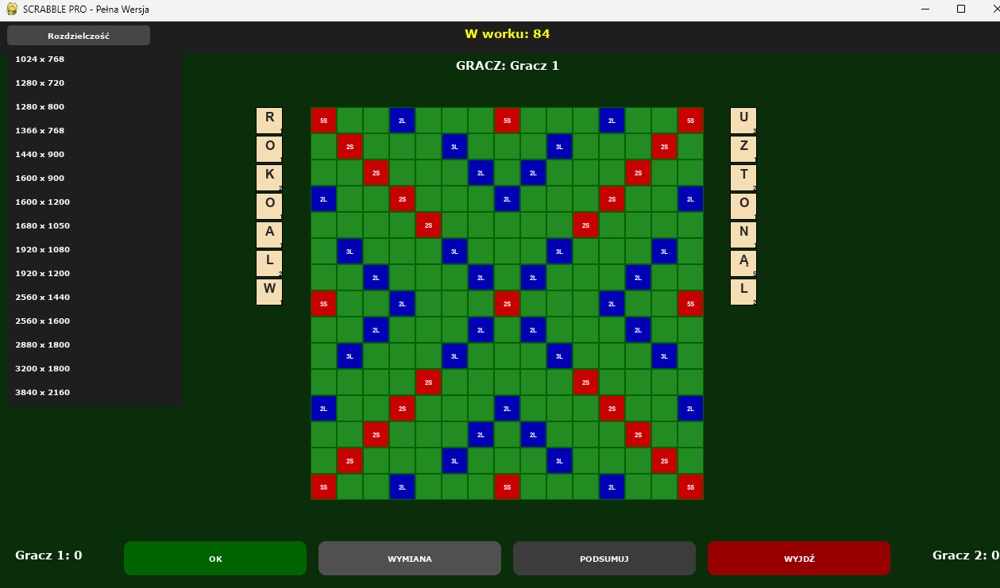

# Scrabble PRO - Python Project

Autorska implementacja gry Scrabble stworzona w Pythonie z wykorzystaniem biblioteki **Pygame**. Projekt skupia się na stabilnej logice układania słów, dynamicznym skalowaniu interfejsu oraz pełnej kontroli nad warstwą dźwiękową.

## 🚀 Funkcje projektu

- **Logika "Zasady Siedmiu"**: System pilnuje, aby gracz zawsze posiadał 7 liter (stojak + ruch).
- **Bezpieczny Stojak**: Intuicyjne podnoszenie i odkładanie liter bez ryzyka ich "zgubienia".
- **Dynamiczne Skalowanie**: Możliwość zmiany rozdzielczości gry w locie (ładowanie ustawień z pliku `rozdzielczosc.txt`).
- **System Punktacji**: Integracja z zewnętrznym modułem `calc.py`, który oblicza punkty na podstawie premii z pliku `plansza.ods`.
- **Panel Kontroli Dźwięku**: 6 dedykowanych przełączników pod planszą pozwalających na aktywację poszczególnych efektów dźwiękowych (.ogg).
- **Kalkulator**: Wyświetlanie równań matematycznych dla każdego ułożonego słowa.

## 🛠️ Wymagania

Do uruchomienia gry potrzebujesz:
- Python 3.x
- Pygame
- Pandas
- Odfpy (do obsługi pliku .ods)

Instalacja bibliotek:
```bash
pip install pygame pandas odfpy